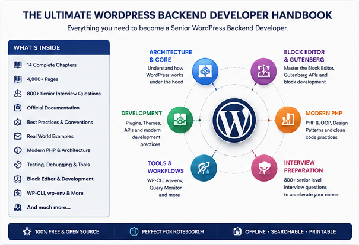

# Frequently Asked Questions

Thank you for checking out the **WordPress Backend Developer Handbook**!

This page answers the questions I expect people to ask most often. If your question isn't answered here, feel free to open an issue on GitHub.

---

# General

## What is this project?

The WordPress Backend Developer Handbook is a large reference work that brings together official WordPress documentation, modern PHP topics, development tools and interview material into one searchable resource.

It currently contains more than **4,800 pages** across fourteen chapters.

The goal isn't to replace the official documentation, but to make it easier to consume as a structured handbook.

---

## Who created this?

I did.

I originally built the handbook as a personal learning resource while studying for senior WordPress backend positions.

After realizing how useful it had become, I decided to publish it in case it could help other developers.

---

## Is this an official WordPress publication?

No.

This is an independent community project.

While much of the content originates from the official WordPress Developer Documentation, this handbook is **not affiliated with, endorsed by, or maintained by the WordPress project or the WordPress Foundation**.

---

## Why create this when the official documentation already exists?

Because I wanted a different way to learn.

The official documentation is excellent, but it's naturally spread across hundreds of pages and multiple websites.

I wanted a single reference that I could:

* read offline
* search quickly
* annotate
* upload into NotebookLM
* keep as a long-term reference
* use while preparing for interviews

---

# The Handbook

## How large is the handbook?

The current version contains:

* 4,800+ pages
* 14 chapters
* 800+ interview questions

New topics will likely be added over time.

---

## Can I download individual chapters?

Yes.

The repository contains both:

* the complete handbook
* individual chapter PDFs

This makes it easier to focus on one topic at a time.

---

## Is there a compressed version?

Yes.

A compressed PDF is available for people who prefer a smaller download.

---

## Is everything included in the full handbook?

Yes.

The complete handbook contains all chapters in a single document.

---

# Formatting

## Why doesn't every page look exactly like the official documentation?

Most chapters were generated automatically using custom scraping scripts.

The goal was to preserve the information while converting web pages into printable PDF documents.

Although the content is complete, some formatting differences are unavoidable.

Examples include:

* spacing
* page breaks
* image placement
* typography
* tables
* code block formatting

Improving the visual presentation is one of my highest priorities for future updates.

---

## Will the formatting improve?

Yes.

As time permits I'd like to improve:

* typography
* page layouts
* syntax highlighting
* code formatting
* image positioning
* overall readability

---

# Google NotebookLM

## Why do you recommend NotebookLM?

Because it changes how you interact with documentation.

Instead of searching manually through thousands of pages, NotebookLM lets you ask questions about the uploaded handbook and receive answers grounded in its content.

It effectively becomes an interactive study partner.

---

## Should I upload the complete handbook?

That depends.

If you want a general reference covering every topic, upload the complete handbook.

If you're studying a specific subject, uploading only the relevant chapter often produces more focused conversations.

---

## Can NotebookLM replace reading the handbook?

Not really.

NotebookLM works best when combined with reading.

Think of it as:

* tutor
* search engine
* quiz generator
* explanation tool

—not as a replacement for learning the material.

---

# Scraping Scripts

## Why are the scraping scripts included?

Transparency.

Including the scripts allows anyone to:

* understand how the handbook was generated
* reproduce the process
* improve the workflow
* adapt it for their own projects

---

## Can I use the scripts myself?

Absolutely.

Feel free to experiment with them and adapt them to your own documentation projects.

---

# Future Development

## Will there be a front-end version?

That's the long-term goal.

The current focus is backend development because that's where most of my professional experience lies.

Eventually I'd like to expand into areas such as:

* React
* Gutenberg Block Development
* WooCommerce
* Headless WordPress
* Performance
* Security

---

## How often is the handbook updated?

There isn't a fixed schedule.

I work on the project in my spare time, so updates happen whenever I have time or when I discover worthwhile improvements.

---

## Will more interview questions be added?

Most likely.

As I continue learning and interviewing, I'll probably add more questions and improve existing ones.

---

# Contributions

## Can I contribute?

Yes.

Bug reports, typo corrections, formatting improvements and constructive suggestions are always welcome.

If you notice something that can be improved, feel free to open an issue.

---

## Are pull requests accepted?

Yes.

If you have a clear improvement that fits the goals of the project, I'd be happy to review it.

---

# Licensing

## Can I use this handbook at work?

Yes.

Many people will likely use it as a reference while developing WordPress projects.

---

## Can I share it with colleagues?

Absolutely.

If you think someone else would find it useful, feel free to share the repository.

---

## Can I redistribute it?

Please refer to the project's LICENSE file before redistributing the handbook or significant parts of it.

---

# Final Thoughts

This project started as a personal learning resource.

If it ends up helping other developers learn WordPress faster, prepare for interviews more effectively, or simply spend less time searching through documentation, then publishing it will have been well worth the effort.

If you have suggestions, ideas or corrections, I'd genuinely love to hear them.

Happy coding!
