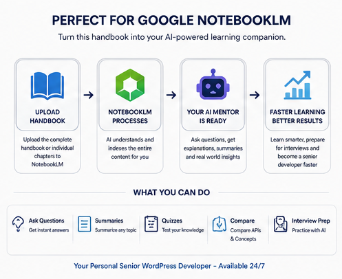

# Using This Handbook with Google NotebookLM

One of the main reasons I created this handbook was to use it as high-quality source material for **Google NotebookLM**.

Instead of browsing hundreds of documentation pages or searching through bookmarks, NotebookLM lets you interact with the handbook conversationally while grounding its answers in the uploaded content.

The result is a personalized AI tutor that understands the material you're currently studying.

<p align="center">

</p>

---

# Why NotebookLM?

NotebookLM is particularly well suited for technical documentation because it can:

* Answer questions about the uploaded handbook
* Explain complex concepts in simpler language
* Generate summaries
* Compare APIs and approaches
* Create quizzes
* Help prepare for interviews
* Find information much faster than manually searching a PDF

Because this handbook is organized into logical chapters, NotebookLM can navigate it remarkably well.

---

# Getting Started

## Option 1 — Upload the Complete Handbook

Upload the full handbook if you want NotebookLM to answer questions across every topic.

This is ideal if you use the handbook as a daily reference.

Examples:

* Explain the WordPress Request Lifecycle.
* Compare WP_Query and get_posts().
* When should I use the Settings API?
* Explain transients.
* Show examples of hooks.

---

## Option 2 — Upload Individual Chapters

For focused learning, upload only the chapter you're currently studying.

For example:

* Plugin Development
* Theme Development
* WP-CLI
* Modern PHP
* Design Patterns

NotebookLM tends to provide more focused answers when fewer documents are uploaded.

---

# Suggested Learning Workflow

I personally recommend the following workflow.

1. Read a chapter normally.
2. Upload the chapter into NotebookLM.
3. Ask questions about anything that isn't clear.
4. Request examples.
5. Generate quizzes.
6. Repeat until you're comfortable with the material.

This creates a feedback loop that is much more engaging than simply reading documentation.

---

# Example Prompts

## Understanding Concepts

```
Explain this topic as if I'm a junior WordPress developer.
```

```
Summarize this chapter in ten bullet points.
```

```
What are the most important things I should remember?
```

```
What mistakes do beginners usually make?
```

---

## Architecture

```
Explain how the WordPress Request Lifecycle works.
```

```
How does WordPress load plugins?
```

```
Explain hooks from start to finish.
```

```
How are templates resolved?
```

---

## Plugin Development

```
How should I structure a professional plugin?
```

```
Generate a plugin skeleton following the practices described in the handbook.
```

```
Explain activation hooks.
```

```
When should I use custom database tables?
```

---

## Theme Development

```
Explain the hierarchy used when rendering templates.
```

```
Compare parent themes and child themes.
```

```
Show me best practices for enqueueing assets.
```

---

## APIs

```
Compare the Options API and Settings API.
```

```
When should I use transients?
```

```
Explain the REST API authentication options.
```

```
Compare wp_remote_get() and cURL.
```

---

## PHP

```
Explain Dependency Injection using examples from WordPress.
```

```
When should I use Traits?
```

```
Explain SOLID using plugin development examples.
```

```
What design patterns appear most often in WordPress?
```

---

## Interview Preparation

```
Interview me as if I'm applying for a Senior WordPress Backend Developer role.
```

```
Ask me twenty difficult plugin development questions.
```

```
Don't reveal the answers until I respond.
```

```
Rate my answers from one to ten.
```

```
Generate follow-up questions.
```

---

## Quizzes

```
Create a beginner quiz.
```

```
Create an advanced quiz.
```

```
Generate ten multiple-choice questions.
```

```
Generate flashcards.
```

```
Create five coding exercises.
```

---

## Practical Learning

```
Design a small project that uses the concepts from this chapter.
```

```
Give me a coding challenge.
```

```
Review my solution.
```

```
Suggest improvements.
```

---

# Building Your Own Learning Plan

NotebookLM is especially useful when learning over several weeks or months.

Example progression:

Week 1

* Architecture
* Coding Standards

Week 2

* Plugin Development

Week 3

* Theme Development

Week 4

* WordPress APIs

Week 5

* WP-CLI
* Debugging

Week 6

* Modern PHP

Week 7

* Design Patterns

Week 8

* Interview Questions

Rather than rushing through the handbook, focus on understanding each chapter before moving on.

---

# Preparing for Interviews

One of my favorite uses for NotebookLM is interview preparation.

Upload the Interview Questions chapter and ask NotebookLM to:

* conduct mock interviews
* ask follow-up questions
* explain incorrect answers
* generate new questions
* identify weak areas

This turns a static PDF into an interactive study partner.

---

# Tips

* Ask follow-up questions instead of starting new conversations.
* Request code examples whenever possible.
* Ask NotebookLM to compare multiple approaches.
* Use it to summarize long chapters before reviewing the details.
* Combine several related chapters for broader discussions.

---

# Limitations

NotebookLM can only answer questions based on the material you provide.

If the handbook doesn't yet cover a particular topic, NotebookLM won't invent new documentation for it.

For the best experience, supplement your learning with:

* The official WordPress Developer Documentation
* The PHP Manual
* Real-world projects
* Experimentation and practice

---

# Final Thoughts

This handbook was intentionally structured so it could be used not only as a PDF, but also as an AI-ready knowledge base.

If you haven't tried NotebookLM before, I highly recommend it.

It has fundamentally changed the way I study technical documentation, and it's one of the main reasons I decided to publish this project.

Hopefully it helps you learn WordPress faster too.

Happy learning!
